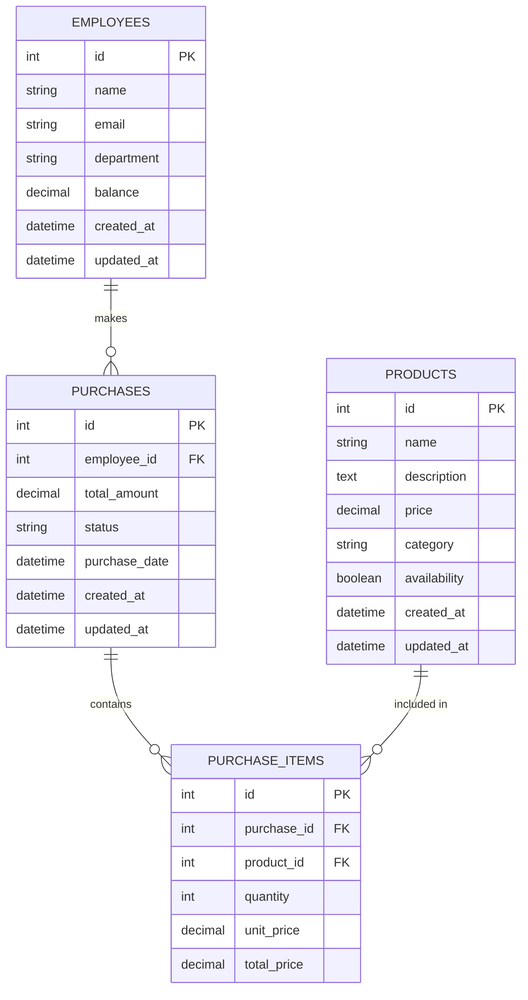

# FeastFrenzy Architecture Documentation

## Overview

FeastFrenzy is a modern, scalable factory canteen management system built with a microservices-oriented architecture. The system is designed to handle employee meal tracking, product management, and financial reporting with high availability and performance.

## System Architecture

### High-Level Architecture

```
┌─────────────────┐    ┌─────────────────┐    ┌─────────────────┐
│   Load Balancer │    │     CDN/Cache   │    │   Monitoring    │
│     (Nginx)     │    │     (Redis)     │    │  (Prometheus)   │
└─────────────────┘    └─────────────────┘    └─────────────────┘
         │                       │                       │
         ▼                       ▼                       ▼
┌─────────────────┐    ┌─────────────────┐    ┌─────────────────┐
│    Frontend     │    │     Backend     │    │    Database     │
│   (Angular)     │◄──►│   (Node.js)     │◄──►│    (MySQL)      │
└─────────────────┘    └─────────────────┘    └─────────────────┘
```

### Technology Stack

#### Frontend
- **Framework**: Angular 15+
- **Language**: TypeScript
- **Styling**: SCSS with Bootstrap 5 & Bootswatch themes
- **Build Tool**: Angular CLI
- **Testing**: Jasmine & Karma

#### Backend
- **Runtime**: Node.js 18+
- **Framework**: Express.js
- **Language**: JavaScript (ES2021+)
- **ORM**: Sequelize
- **Authentication**: JWT
- **Testing**: Mocha, Chai, Supertest

#### Database
- **Primary**: MySQL 8.0+
- **Cache**: Redis 7+
- **Migrations**: Sequelize migrations

#### Infrastructure
- **Containerization**: Docker & Docker Compose
- **CI/CD**: GitHub Actions
- **Monitoring**: Prometheus & Grafana
- **Logging**: Winston (Backend), Console (Frontend)

## Component Architecture

### Frontend Architecture

```
src/
├── app/
│   ├── core/                    # Singleton services, guards
│   │   ├── services/           # HTTP, Auth, Error services
│   │   ├── guards/             # Route guards
│   │   └── interceptors/       # HTTP interceptors
│   ├── shared/                 # Reusable components, pipes
│   │   ├── components/         # Common UI components
│   │   ├── pipes/              # Custom pipes
│   │   └── models/             # TypeScript interfaces
│   ├── features/               # Feature modules
│   │   ├── employees/          # Employee management
│   │   ├── products/           # Product catalog
│   │   ├── purchases/          # Purchase transactions
│   │   └── reports/            # Reporting module
│   └── layout/                 # Layout components
└── environments/               # Environment configurations
```

### Backend Architecture

```
backend/
├── controllers/                # Request handlers
├── middleware/                 # Custom middleware
├── models/                     # Sequelize models
├── routes/                     # API routes
├── services/                   # Business logic
├── utils/                      # Utility functions
├── config/                     # Configuration files
├── logger/                     # Logging configuration
└── test/                       # Test files
```

## Data Architecture

### Database Schema

#### Core Entities

1. **Employees**
   - `id` (Primary Key)
   - `name`, `email`, `department`
   - `balance` (Current cash balance)
   - `created_at`, `updated_at`

2. **Products**
   - `id` (Primary Key)
   - `name`, `description`, `price`
   - `category`, `availability`
   - `created_at`, `updated_at`

3. **Purchases**
   - `id` (Primary Key)
   - `employee_id` (Foreign Key)
   - `total_amount`, `status`
   - `purchase_date`
   - `created_at`, `updated_at`

4. **Purchase Items**
   - `id` (Primary Key)
   - `purchase_id` (Foreign Key)
   - `product_id` (Foreign Key)
   - `quantity`, `unit_price`, `total_price`

### Entity Relationships



## API Architecture

### RESTful Endpoints

#### Authentication
- `POST /api/auth/login` - User authentication
- `POST /api/auth/refresh` - Token refresh
- `POST /api/auth/logout` - User logout

#### Employees
- `GET /api/employees` - List all employees
- `GET /api/employees/:id` - Get employee details
- `POST /api/employees` - Create new employee
- `PUT /api/employees/:id` - Update employee
- `DELETE /api/employees/:id` - Delete employee

#### Products
- `GET /api/products` - List all products
- `GET /api/products/:id` - Get product details
- `POST /api/products` - Create new product
- `PUT /api/products/:id` - Update product
- `DELETE /api/products/:id` - Delete product

#### Purchases
- `GET /api/purchases` - List purchases
- `GET /api/purchases/:id` - Get purchase details
- `POST /api/purchases` - Create new purchase
- `PUT /api/purchases/:id` - Update purchase
- `DELETE /api/purchases/:id` - Delete purchase

#### Reports
- `GET /api/reports/employee-consumption` - Monthly employee consumption
- `GET /api/reports/product-consumption` - Product consumption report
- `GET /api/reports/revenue` - Revenue reports

#### System
- `GET /health` - Health check endpoint
- `GET /metrics` - Prometheus metrics

### Response Format

All API responses follow a consistent format:

```json
{
  "success": true,
  "data": {
    // Response data
  },
  "message": "Success message",
  "timestamp": "2024-01-01T12:00:00Z",
  "pagination": {
    "page": 1,
    "limit": 20,
    "total": 100,
    "pages": 5
  }
}
```

Error responses:

```json
{
  "success": false,
  "error": {
    "code": "VALIDATION_ERROR",
    "message": "Invalid input data",
    "details": {
      "field": "email",
      "reason": "Invalid email format"
    }
  },
  "timestamp": "2024-01-01T12:00:00Z"
}
```

## Security Architecture

### Authentication & Authorization

1. **JWT Token-based Authentication**
   - Access tokens (short-lived, 7 days)
   - Refresh tokens (long-lived, 30 days)
   - Automatic token refresh mechanism

2. **Role-based Access Control (RBAC)**
   - Employee role: Can make purchases, view own data
   - Manager role: Can view reports, manage products
   - Admin role: Full system access

3. **Security Headers**
   - CORS configuration
   - Helmet.js security headers
   - Rate limiting
   - Request validation

### Data Protection

1. **Encryption**
   - Password hashing with bcrypt (12 rounds)
   - JWT signing with strong secrets
   - HTTPS in production

2. **Validation**
   - Input sanitization
   - SQL injection prevention (Sequelize ORM)
   - XSS protection

## Performance Architecture

### Caching Strategy

1. **Application Level**
   - Redis for session storage
   - API response caching
   - Database query result caching

2. **Database Level**
   - Query optimization
   - Proper indexing strategy
   - Connection pooling

3. **Frontend Level**
   - Angular service worker
   - Component lazy loading
   - Asset optimization

### Monitoring & Observability

1. **Metrics Collection**
   - Prometheus for metrics
   - Custom application metrics
   - Database performance metrics

2. **Logging**
   - Structured logging with Winston
   - Log levels and rotation
   - Error tracking and alerting

3. **Health Checks**
   - Application health endpoints
   - Database connectivity checks
   - External service dependencies

## Deployment Architecture

### Containerization

- Multi-stage Docker builds
- Optimized image sizes
- Non-root user execution
- Health check definitions

### CI/CD Pipeline

1. **Code Quality Gates**
   - Linting and formatting
   - Unit testing
   - Security scanning
   - Code coverage thresholds

2. **Build Process**
   - Multi-environment builds
   - Artifact storage
   - Container registry push

3. **Deployment Strategy**
   - Blue-green deployments
   - Rolling updates
   - Automated rollback capabilities

### Environment Management

- Development: Local Docker Compose
- Staging: Kubernetes cluster
- Production: Kubernetes with HA setup

## Scalability Considerations

### Horizontal Scaling

- Stateless application design
- Load balancer configuration
- Database read replicas
- Cache cluster setup

### Vertical Scaling

- Resource monitoring and alerting
- Auto-scaling policies
- Performance optimization

### Future Enhancements

1. **Microservices Migration**
   - Service decomposition strategy
   - API gateway implementation
   - Inter-service communication

2. **Advanced Features**
   - Real-time notifications (WebSockets)
   - Mobile application support
   - Advanced analytics and ML

3. **Infrastructure**
   - Kubernetes deployment
   - Service mesh integration
   - Advanced monitoring stack